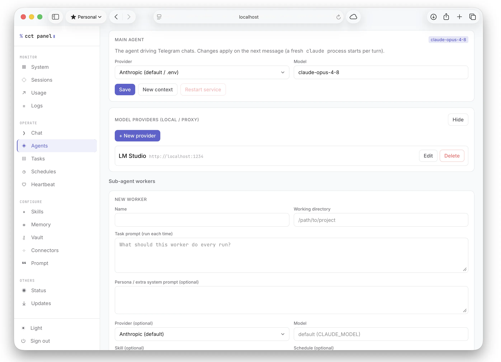
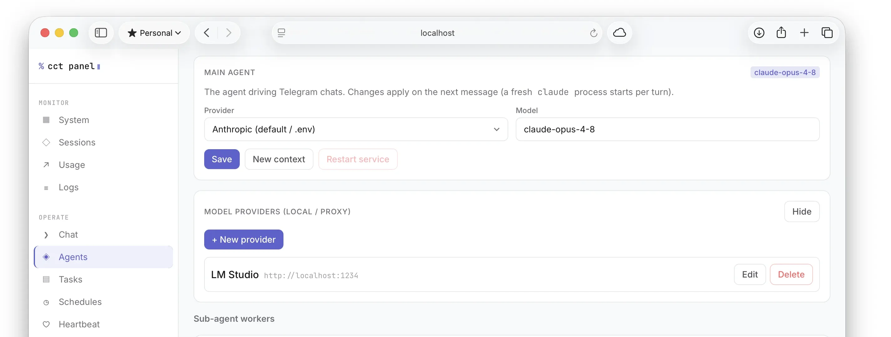
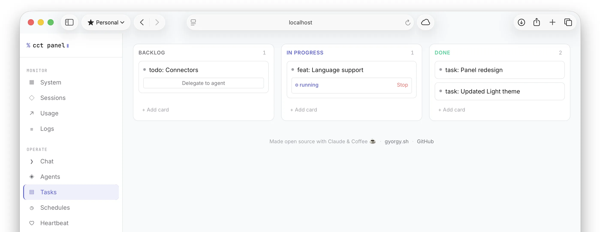
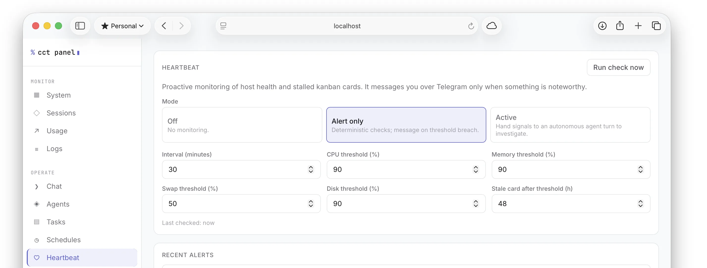
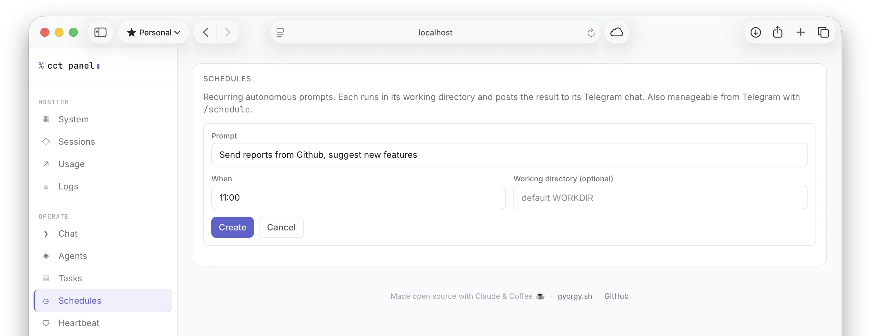

# MyHQ — Your Personal AI Headquarters

**A self-hosted fleet of autonomous AI agents, deeply integrated with Telegram.** Talk to Atlas, your central coordinator, from your phone. He runs day-to-day operations, remembers everything, learns your workflows, and commands a team of specialized Leads. Each Lead owns a domain and can have its own Telegram bot.



Open source. Built on real **Claude Code** agents running on your machine, so every agent can read files, run commands, edit code, check services, and ship things — with replies streaming back live and risky actions gated behind your approval.

> ⚠️ **These agents can read, write, and run commands on the machine they run on.** Access is gated by a Telegram user-id allow-list (and, for the panel, a secret token). Keep `ALLOWED_USER_IDS` tight and run it on a machine you control.

## The Command Structure

MyHQ runs a government-style hierarchy. Every agent knows their role and who they report to.

```
You (President)
└── Atlas  ·  your central coordinator, runs everything day-to-day
    ├── Finance Lead   ·  cost tracking, budgets, analytics
    ├── DevOps Lead    ·  infra, deployments, monitoring
    ├── Research Lead  ·  deep dives, reports, synthesis
    └── … any Lead you create, each with their own Telegram bot
        ├── Assistant
        └── Assistant
```

**You** set direction and make final calls. **Atlas** coordinates the team, handles whatever you send him, and knows his Leads' portfolios. **Leads** own their domain — they run specialized autonomous turns, have their own memory and session, and optionally appear as a separate Telegram bot you can message directly. **Assistants** are sub-agents scoped to a Lead.

## Two Ways In

The same agents, two front doors:

**Telegram**: message Atlas from your phone. The old loop for touching a server (open a terminal, SSH in, run something, close it) becomes a chat with something already living on the server that knows your system. When a service falls over at 2 am you get a ping and fix it from the couch, no SSH client required. Your Leads have their own bots, so you can message your DevOps Lead directly without going through Atlas.

**MyHQ Panel**: an optional web dashboard served in the same process. Chat with Atlas in the browser, see your full crew hierarchy, watch live system health, run and schedule agents, delegate task-board cards to autonomous runs, browse memory and skills, manage secrets, and tune proactive monitoring.

## The Panel

| | |
| --- | --- |
|  |  |
| **Crew**: configure Atlas's model live; create Leads and Assistants with their own model, persona, skill, portfolio, and optional Telegram token. The Crew tab shows the full org chart. | **Tasks**: a Kanban board (Backlog / In progress / Done) with drag-and-drop, priority, WIP limits, and a Delegate button that hands a card to an autonomous agent run. |
|  |  |
| **Heartbeat**: proactive monitoring. Set CPU/mem/swap/disk thresholds; Atlas pings Telegram on breach, or runs an autonomous turn to investigate and act first. | **Schedules**: create timed autonomous prompts (`30m`, `2h`, `HH:MM`) from the panel or via `/schedule` in chat, with results pushed back to Telegram. |

Also inside: **System** (live CPU per-core, memory, swap, disk I/O), **Status** (Claude service status + provider/local-backend probes), **Memory** (browse / search / edit), **Vault** (AES-256-GCM secrets), **Skills**, **Prompt** (playbook editor), **Logs** (live tail), and more.

## In Telegram

| | |
| --- | --- |
|  |  |
| Upload files and photos — Atlas *sees* images inline. Here he asks for approval before running a `Bash` command. | Replies stream back live as they're written using Telegram's Rich Messages API, then land as a clean formatted message. |
|  |  |
| Tap **✅ Approve**, **❌ Deny**, or **♾️ Always allow** — the last option whitelists the tool for the rest of the session. | Every non-read-only tool call pauses and shows exactly what's about to run before it happens. |

## What Makes It a Fleet, Not Just a Bot

**Memory that accumulates.** Every conversation, Atlas and your Leads save durable facts with `memory_write` and recall the relevant ones automatically on the next turn. They adapt to you over time without manual setup — preferences, project facts, workflow decisions all persist.

**Skills that compound.** When Atlas works out a procedure worth reusing, he distils it into the skills library with `skill_save`. Next time a similar request comes in, he pulls the skill and runs it. The library grows with use.

**Leads with portfolios.** Each Lead has a domain — Finance, DevOps, Research, whatever you define. Their system prompt is shaped around that portfolio so they think and act like a specialist, not a generalist. Create a Lead for anything recurring in your life or work.

**Lead bots.** Give a Lead a Telegram bot token and they get their own chat. Message your Finance Lead directly with spend questions. Message your DevOps Lead directly for infra work. Same allowed-user list as Atlas, separate sessions and context.

**Atlas knows his team.** Every turn, Atlas's system prompt is automatically updated with the current Lead roster — who they are, what they own. He can reference them, coordinate with them, and tell you which Lead to ask.

**Autonomous delegation.** Task cards on the board can be delegated to an agent run with one button. The agent can break the card into subtasks, complete them, and move the card to Done without you touching it.

**Proactive monitoring.** The heartbeat runs in the background watching host health and stalled task cards. It can alert you, or it can run an autonomous turn to investigate and act first.

**Scheduled runs.** Set any agent or Lead to run a prompt on a timer — check disk space at 9am, summarize logs every 2 hours, pull a report every Monday.

## Quick Install

On a fresh **Linux** or **macOS** machine, the wizard installs everything (Node 20+, git, the Claude CLI), clones the repo, builds it, walks you through `.env`, and optionally sets up a background service:

```bash
curl -fsSL https://gyorgy.sh/myhq-install.sh | bash
```

You'll need a [bot token](#setup-manual) and your numeric Telegram user id. The wizard prompts for both. Prefer to read before you run? The script is [`scripts/myhq-install.sh`](scripts/myhq-install.sh).

> For an unattended run, set `MYHQ_TOKEN`, `MYHQ_USER_IDS`, and `MYHQ_MODE=service|manual` (and `MYHQ_YES=1`) in the environment.

## Setup (manual)

> No background services installed — full functionality is available. Install as a service later without touching your checkout or data.

1. **Create a bot**: message [@BotFather](https://t.me/BotFather), run `/newbot`, copy the token.
2. **Find your user id**: message [@userinfobot](https://t.me/userinfobot).
3. **Configure**:
   ```bash
   cp .env.example .env
   # edit .env: TELEGRAM_BOT_TOKEN, ALLOWED_USER_IDS, WORKDIR
   ```
4. **Install and run**:
   ```bash
   npm install
   npm run dev         # watch mode (reloads on change)
   # or: npm run build && npm start
   ```

## Run as a Service

```bash
./scripts/install-service.sh        # builds, installs and starts the service
./scripts/agentctl.sh status        # start | stop | restart | status | logs
./scripts/agentctl.sh logs          # follow logs
```

**Linux**: systemd unit (`myhq`). The installer adds a scoped, passwordless sudoers rule.

**macOS**: per-user LaunchAgent (`sh.gyorgy.myhq`) that runs in your login session; no sudo needed.

You can also ask Atlas to restart himself: *"restart yourself"* triggers `./scripts/agentctl.sh restart`.

### Update and uninstall

```bash
./scripts/update.sh                 # git pull + npm install + build, restarts if service is installed
./scripts/uninstall-service.sh      # remove the service (leaves checkout, .env and data/ intact)
```

## Configuration

| Variable | Required | Description |
| --- | --- | --- |
| `TELEGRAM_BOT_TOKEN` | yes | Token from @BotFather (Atlas's bot) |
| `ALLOWED_USER_IDS` | yes | Comma-separated numeric Telegram user ids — the allow-list for all bots |
| `WORKDIR` | no | Directory Atlas starts in (default: `data/`) |
| `STATE_FILE` | no | Session + usage persistence path (default `data/state.json`) |
| `CLAUDE_MODEL` | no | Default model id (default `claude-opus-4-8`) |
| `ANTHROPIC_API_KEY` | no | API key; omit to use `claude` CLI login |
| `APPROVAL_TIMEOUT_MS` | no | Approval wait before auto-deny (default `300000`) |
| `STREAM_MODE` | no | `rich` (default), `draft`, or `edit` |
| `TRANSCRIBE_PROVIDER` | no | Voice backend: `openai` (default) or `vosk` (local) |
| `OPENAI_API_KEY` | no | API key for the `openai` voice backend (OpenAI, Groq, …) |
| `TRANSCRIBE_MODEL` | no | Transcription model (default `whisper-1`) |
| `TRANSCRIBE_BASE_URL` | no | OpenAI-compatible base URL (default `https://api.openai.com/v1`) |
| `VOSK_MODEL_PATH` | no | Path to an unpacked Vosk model dir (enables the `vosk` backend) |
| `FFMPEG_PATH` | no | ffmpeg binary for voice note decoding (default `ffmpeg`) |
| `LOG_LEVEL` | no | `error` \| `warn` \| `info` (default) \| `debug` |
| `WORK_FILE` | no | Path to Atlas's operator playbook (default `work.md`) |
| `PANEL_ENABLED` | no | `true` to start the MyHQ Panel (default `false`) |
| `PANEL_TOKEN` | when panel on | Shared secret for all panel requests; startup fails without it |
| `PANEL_HOST` | no | Bind address (default `127.0.0.1`) |
| `PANEL_PORT` | no | Port (default `8787`) |
| `PANEL_CHAT_ENABLED` | no | `false` to hide the panel Chat view (default `true`) |
| `PANEL_CHAT_BYPASS` | no | `true` to unlock the Chat's auto (no-approval) mode (default `false`) |

### Streaming modes

| Mode | How it works | Notes |
| --- | --- | --- |
| `rich` | Bot API 10.1 Rich Messages | Default. Structured formatting. Private chats only. |
| `draft` | Bot API 9.3 `sendMessageDraft` → `sendMessage` | Animated preview, finalized as a formatted message. Private chats only. |
| `edit` | Throttled `editMessageText` of a placeholder | Most compatible fallback. Works in any chat type. |

### Voice

Send a voice note and it's transcribed and run like a typed prompt. Two backends via `TRANSCRIBE_PROVIDER`:

**`openai`** (default): any OpenAI-compatible `/audio/transcriptions` endpoint. Use OpenAI directly, or **Groq's free tier**: set `TRANSCRIBE_BASE_URL=https://api.groq.com/openai/v1`, `TRANSCRIBE_MODEL=whisper-large-v3-turbo`, and a Groq `OPENAI_API_KEY`.

**`vosk`**: fully local and offline.
```bash
npm install vosk
# install ffmpeg, download and unpack a model from https://alphacephei.com/vosk/models
```
Then set `VOSK_MODEL_PATH=/path/to/vosk-model` and `TRANSCRIBE_PROVIDER=vosk`.

## Enabling the Panel

The panel is served **in the same process** as the bot (no extra service). Off by default because it has the same reach as the bot.

```bash
PANEL_ENABLED=true
PANEL_TOKEN=choose-a-long-random-secret   # required; startup fails without it
```

```bash
npm run build && npm start
# dev: npm run dev   (bot + panel reload together)
```

Open `http://127.0.0.1:8787` and unlock with your `PANEL_TOKEN`. Keep the bind on loopback and reach it only behind a reverse proxy or private network (e.g. Tailscale). Light / dark / hacker themes, URL per view.

## Permissions

Nothing runs without your say-so. For every non-read-only tool call you get an inline prompt showing exactly what's about to happen:

**✅ Approve** — run it once.
**❌ Deny** — refuse it.
**♾️ Always allow `<Tool>`** — stop asking for that tool for the rest of this session.

Switch a chat to autonomous mode with `/mode auto` (and back with `/mode safe`). Read-only tools (`Read` / `Glob` / `Grep`) always run automatically. Lead bots default to the same safe mode with the same approve/deny prompts.

## Full Feature List

- **Crew hierarchy**: President → Atlas → Leads → Assistants. Each level knows the one above it. Leads have portfolios, their own sessions, and optionally their own Telegram bots.
- **Live streaming**: uses Telegram's Rich Messages (Bot API 10.1) and message drafts (Bot API 9.3) — replies animate as previews and land as clean, structured messages.
- **Durable memory**: agents save facts with `memory_write` and recall the relevant ones into every turn automatically. Adapts to you over time without any setup.
- **Skill factory**: Atlas distils reusable workflows into a skills library with `skill_save` and refines them with `skill_patch`. Skills are loaded into any agent's system prompt.
- **Proactive monitoring**: optional heartbeat watches host health (CPU/mem/swap/disk) and stalled task cards, pinging Telegram on breach, or running an autonomous turn to investigate first.
- **Secret vault**: AES-256-GCM encrypted secrets with the master key in the macOS Keychain (file fallback on Linux). Reference secrets anywhere as `vault:<id>` so tokens never sit in plaintext.
- **Multi-agent task delegation**: task board cards can be delegated to an autonomous run. The agent can break cards into subtasks, complete them, and move the card to Done.
- **Operator playbook (`work.md`)**: define once how recurring jobs should be done — restart Apache, edit crontab safely, deploy a project. Re-read every turn, so edits apply instantly.
- **Session continuity**: context carries across messages; `/new` resets it. Sessions (resume token, cwd, mode, allow-lists, usage) survive restarts.
- **Git review from chat**: `/diff` shows the diff with inline Commit / Discard buttons; `/commit <message>` stages and commits.
- **Voice notes**: transcribed and run as prompts via OpenAI-compatible API (OpenAI, Groq) or fully local Vosk.
- **Local model support**: point Atlas or any Lead at LM Studio, Ollama, or any Anthropic-compatible proxy, switchable live from the panel.
- **File send/receive**: upload files and photos (agents see images inline); agents can send files back via the built-in `send_file` tool.
- **Scheduled runs**: timed autonomous prompts on any interval or daily time, per-agent.
- **Quiet by default**: messages from anyone not on the allow-list are silently ignored.

## Commands (Atlas)

| Command | Action |
| --- | --- |
| `/new` | Start a fresh conversation |
| `/cd <path>` | Change working directory |
| `/pwd` | Show current directory |
| `/status` | Show session info (cwd, Atlas model, mode, session id) |
| `/projects` | Saved working dirs — switch/add/remove via inline buttons |
| `/diff` | Review the working-tree diff, then commit or discard inline |
| `/commit <message>` | Stage all changes and commit |
| `/usage` | Show cost and activity for this chat (today + lifetime) |
| `/allow <Tool>` · `/allowed` · `/disallow <Tool\|all>` | Manage persistent always-allow rules |
| `/schedule [list]` · `/schedule add <when> \| <prompt>` · `/schedule rm <id>` | Timed autonomous prompts (`when` = `30m`/`2h`/`1d` or `HH:MM`) |
| `/stop` | Abort the running request |
| `/mode safe\|auto` | Interactive approval (default) or autonomous |
| `/help` | Show help |

Lead bots support `/status`, `/stop`, `/mode`, and `/help`.

## Architecture

```
src/
  index.ts            entry: load config, build Atlas bot, start Lead bots, launch
  config.ts           env parse + validation (zod)
  auth.ts             allow-list middleware (silently drops non-admins)
  logger.ts           structured logger (LOG_LEVEL)
  prompt.ts           Atlas personality + work.md + crew roster → system prompt (per turn)
  bot.ts              Telegraf wiring + per-turn orchestration
  commands.ts         /new /cd /pwd /status /projects /diff /commit /usage /allow /schedule /stop /mode /help
  git.ts              shell-free git helpers (status, diff, commit, restore)
  session/
    manager.ts        per-chat state (sessionId, cwd, busy, mode, allow-lists, projects, usage)
    store.ts          JSON persistence across restarts; optional stateFile param for Lead sessions
  schedule/
    manager.ts        schedule parsing, next-run math, tick loop
    store.ts          JSON persistence
  claude/
    runner.ts         wraps the Agent SDK query(); fans events to callbacks; inline image vision
    events.ts         narrow type guards over SDK messages
  core/               telegraf-free layer shared by all agents and the panel
    health.ts         system-health snapshot (CPU/mem/swap/disk/IO)
    status.ts         public Claude status + provider/local-backend probes
    snapshot.ts       read-only session/usage views
    chat.ts           the panel's dedicated Claude chat session
    memory.ts         durable fact store (memory.json) recalled into each turn
    vault.ts          AES-256-GCM secrets (keychain/file master key)
    heartbeat.ts      proactive host/kanban monitoring loop
    connectors.ts     external-connector catalog (placeholders)
    playbook.ts       read/write the operator playbook (work.md)
    skills.ts         reusable prompt library (skills.json)
    claudeFiles.ts    scoped browser/editor for on-disk .claude/* + CLAUDE.md
    tasks.ts          task board (tasks.json) · taskRunner.ts  delegate-to-agent
    workers.ts        crew registry: Leads + Assistants + specialists; concurrent run manager
    providers.ts      local/proxy model-endpoint presets · providerModels.ts  model listing
    mainSettings.ts   Atlas model/provider override · agentControl.ts  service restart
    jsonStore.ts      atomic JSON store helper · audit.ts  append-only audit log
  panel/
    server.ts         in-process Fastify: token auth, REST API, static SPA
    hub.ts            WebSocket fan-out (worker/chat/task events + health/log push)
  mcp/
    sendFile.ts       send a file back to Telegram
    memory.ts         memory_write/search/list
    tasks.ts          task_create/list/update
    skills.ts         skill_save/patch/list
  telegram/
    leadBot.ts           slim Telegraf instance per Lead with a telegramToken
    streamer.ts          edit-in-place streaming backend
    baseDraftStreamer.ts  shared draft machinery (throttle + keepalive)
    draftStreamer.ts      Bot API 9.3 draft backend
    richDraftStreamer.ts  Bot API 10.1 Rich Messages backend
    send.ts            shared final-message sender (markdown → HTML, splitting)
    formatting.ts      markdown → Telegram HTML
    permissions.ts     approval keyboards + always-allow registry
    gitFlow.ts         /diff rendering + commit/discard callbacks
    projects.ts        /projects switch menu
    voice.ts           voice-note transcription dispatcher (openai | vosk)
    vosk.ts            local offline transcription (ffmpeg + Vosk)
    files.ts           incoming file downloads + image decoding for vision

panel/                MyHQ Panel frontend (React + Vite + Tailwind v4)
                      built to panel/dist, served by src/panel/server.ts
  components/
    Crew.tsx          org chart view: President → Atlas → Leads → Assistants
    Workers.tsx       crew management (create/edit Leads, Assistants, specialists)
    MainAgent.tsx     Atlas model/provider controls
    …                 Chat, Health, Tasks, Schedules, Memory, Vault, Skills, …
```

Built on [`telegraf`](https://github.com/telegraf/telegraf) and [`@anthropic-ai/claude-agent-sdk`](https://www.npmjs.com/package/@anthropic-ai/claude-agent-sdk); the panel uses [`fastify`](https://fastify.dev) + [`systeminformation`](https://systeminformation.io) on the server and React + Vite + Tailwind on the client.

## Troubleshooting

**Atlas doesn't respond**: confirm your numeric id is in `ALLOWED_USER_IDS` — unknown users are silently ignored. Check logs with `LOG_LEVEL=debug`.

**`npm start` shows stale behavior**: `npm start` runs compiled `dist/`; rebuild with `npm run build` first.

**Rich formatting looks off**: try `STREAM_MODE=draft` or `STREAM_MODE=edit`. Rich/draft modes require a private chat.

**Approvals never resolve**: make sure only one instance is polling — two pollers split updates.

**Lead bot not starting**: check that `telegramToken` is a valid `vault:<id>` reference pointing to a real bot token in the vault, and that the Lead is enabled.

## Credits

Created by **Gyorgy**. [gyorgy.sh](https://gyorgy.sh) · [github.com/gyorgysh](https://github.com/gyorgysh).

> 🤖 Built hand-in-hand with Claude — which is fitting, since the whole thing exists to put Claude agents in your pocket. Claude helped build the fleet that lets you talk to Claude. Turtles all the way down.

## License

MIT
